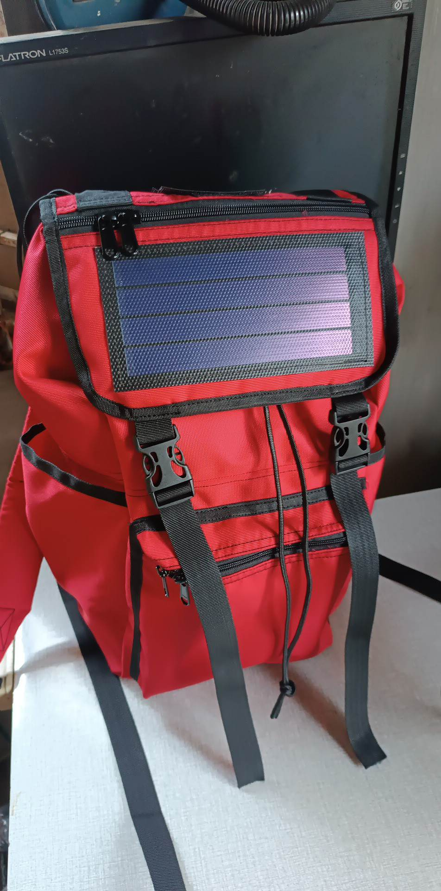
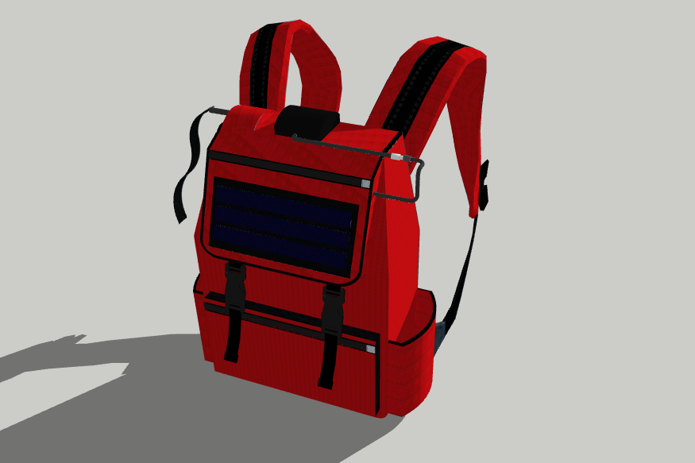

# Emergency Smart Safety Bag (Solar-Powered)

This project is a **smart emergency safety bag** designed to enhance personal security. It integrates **GSM communication, alarm system, and solar charging** to provide immediate response during emergencies.

When a strap is pulled, the system can:
- send an **SMS alert to a predefined phone number**
- trigger a **loud buzzer alarm**
- operate independently using a **solar-powered battery system**

---

## Project Overview

The system is embedded inside a bag and works as a **portable safety device**.

### Key Functions:
- Emergency SMS alert  
- Audible alarm (anti-theft / distress)  
- Solar-powered charging system  

This makes it suitable for:
- students  
- commuters  
- travelers  
- personal safety use  

---

## Features

### 📩 SMS Emergency Alert
- Pulling the main strap triggers:
  - automatic SMS sending  
- Sends alert to predefined phone number  
- Uses GSM module (SIM800/900)

---

### 🔔 Buzzer Alarm System
- Separate strap triggers buzzer  
- Emits loud sound to:
  - attract attention  
  - deter threats  

---

### ☀️ Solar Charging System
- Flexible solar panel mounted on bag  
- Charges battery during daylight  
- Provides portable power  

---

### 🔋 Battery + Charge Controller
- Rechargeable battery system  
- Charge controller regulates:
  - solar input  
  - battery charging  
- Ensures safe and stable power  

---

### 🎒 Portable Design
- Fully integrated into a backpack  
- Discreet and easy to use  
- No need for external power  

---

## System Workflow

### 1. Normal State
- System is idle  
- Battery powered (charged via solar panel)  

---

### 2. Emergency Trigger (SMS)
- User pulls emergency strap  
- Arduino activates GSM module  
- SMS is sent automatically  

---

### 3. Alarm Trigger (Buzzer)
- User pulls second strap  
- Buzzer activates immediately  

---

### 4. Power Management
- Solar panel charges battery  
- Charge controller regulates voltage  
- System remains operational even without external power  

---

## Hardware Components

- Arduino (Uno / Nano)  
- GSM Module (SIM800 / SIM900)  
- Flexible Solar Panel  
- Solar Charge Controller  
- Rechargeable Battery (Li-ion / LiPo)  
- Buzzer  
- Pull Switch / Trigger Strap (2x)  
- Wires and connectors  

---

## Pin Configuration

*(Adjust based on your actual code)*

| Component        | Arduino Pin |
|------------------|------------|
| GSM TX           | Arduino RX |
| GSM RX           | Arduino TX |
| Buzzer           | Digital Pin |
| SMS Trigger Strap| Digital Pin |
| Alarm Strap      | Digital Pin |

---

## Wiring Overview

### 📡 GSM Module
- TX → Arduino RX  
- RX → Arduino TX  
- VCC → External power (recommended)  
- GND → GND  

---

### 🔘 Emergency Strap (SMS)
- One side → Arduino pin  
- Other side → GND  
- Uses INPUT_PULLUP  

---

### 🔘 Alarm Strap (Buzzer)
- One side → Arduino pin  
- Other side → GND  

---

### 🔔 Buzzer
- Positive → Arduino digital pin  
- Negative → GND  

---

### ☀️ Solar Charging System
- Solar panel → Charge controller  
- Charge controller → Battery  
- Battery → Arduino (via regulator)  

---

## Notes

- GSM module requires stable power (often external 5V–4.2V)  
- Solar charging depends on sunlight availability  
- Use proper voltage regulation for Arduino  
- Ensure straps are securely mounted for reliable triggering  

---

## Limitations

- SMS depends on GSM signal availability  
- No GPS location included (can be added)  
- No mobile app integration  
- Limited battery capacity  

---

## Summary

This project demonstrates a **portable emergency safety system** that combines:

- GSM communication (SMS alerts)  
- alarm system (buzzer)  
- renewable energy (solar charging)  
- embedded system control (Arduino)  

It is suitable for:

- personal safety devices  
- anti-theft systems  
- emergency response tools  
- IoT safety prototypes

